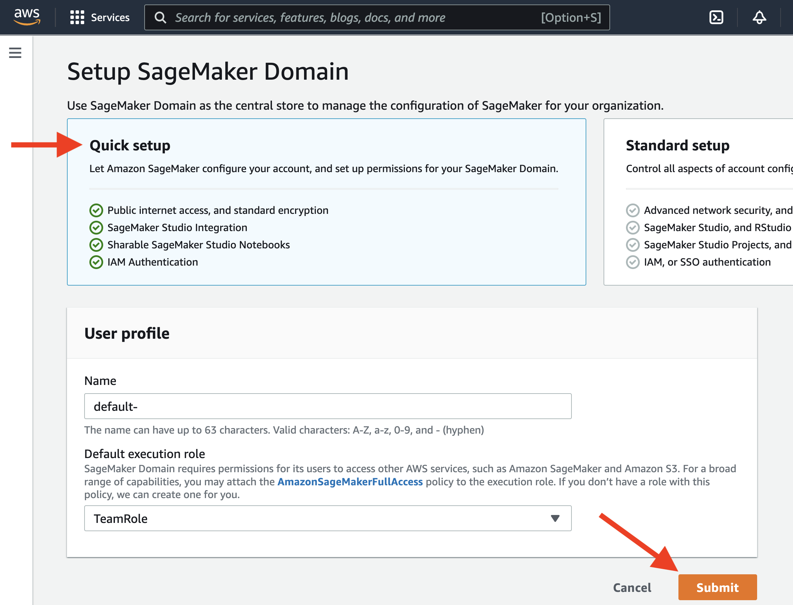
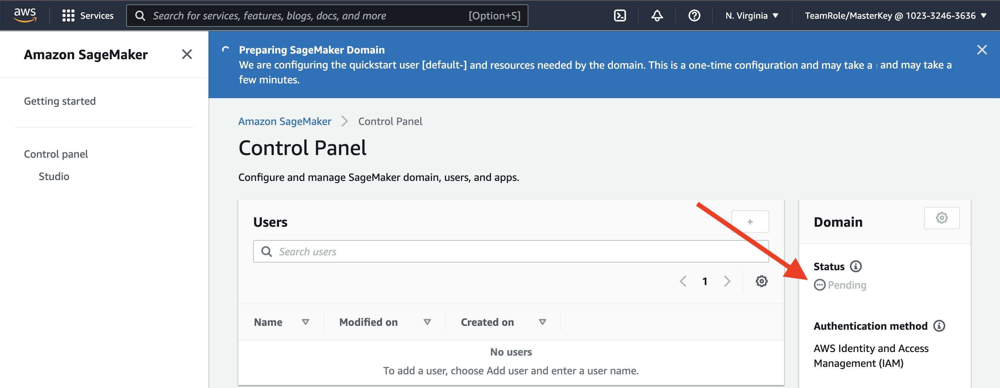
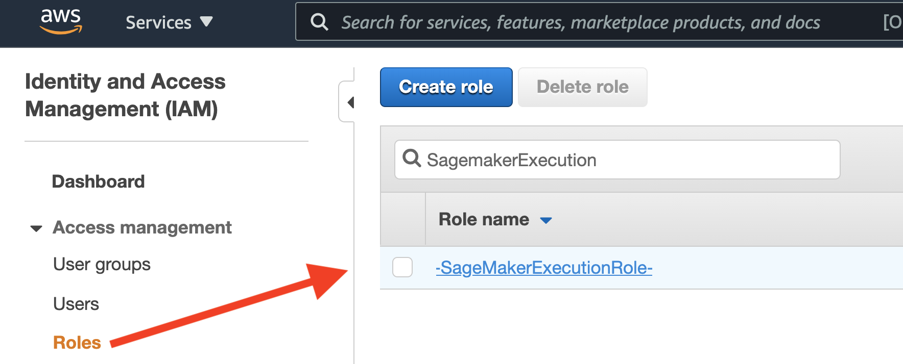
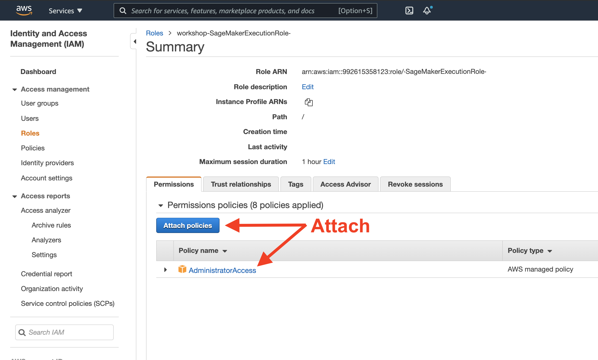

# Data Science on AWS - O'Reilly Book

Select a branch to explore...

[](https://github.com/data-science-on-aws/data-science-on-aws/tree/oreilly-book)
[](https://github.com/data-science-on-aws/data-science-on-aws/tree/generative)
[](https://github.com/data-science-on-aws/data-science-on-aws/tree/bert)
[](https://github.com/data-science-on-aws/data-science-on-aws/tree/xgboost)


## Get the book on [Amazon.com](https://www.amazon.com/Data-Science-AWS-End-End/dp/1492079391)!
[](https://www.amazon.com/Data-Science-AWS-End-End/dp/1492079391/)

## YouTube Video
[YouTube Video](https://youtu.be/9_SWaKdZhEM)

## Book Outline


## Book Examples (12 hours)
Throughout these book examples, you will build an end-to-end AI/ML pipeline for natural language processing with Amazon SageMaker.  You will train and tune a text classifier to predict the star rating (1 is bad, 5 is good) for product reviews using the state-of-the-art [BERT](https://arxiv.org/abs/1810.04805) model for language representation.  To build our BERT-based NLP text classifier, you will use a product reviews dataset where each record contains some review text and a star rating (1-5).  You will also get hands-on with advanced model training and deployment techniques such as hyper-parameter tuning, A/B testing, and auto-scaling.  Lastly, you will setup a real-time, streaming analytics and data science pipeline to perform window-based aggregations and anomaly detection.

## Learning Objectives for the Book Examples
Attendees will learn how to do the following:
* Ingest data into S3 using Amazon Athena and the Parquet data format
* Visualize data with pandas, matplotlib on SageMaker notebooks
* Detect statistical data bias with SageMaker Clarify
* Perform feature engineering on a raw dataset using Scikit-Learn and SageMaker Processing Jobs
* Store and share features using SageMaker Feature Store
* Train and evaluate a custom BERT model using TensorFlow, Keras, and SageMaker Training Jobs
* Evaluate the model using SageMaker Processing Jobs
* Track model artifacts using Amazon SageMaker ML Lineage Tracking
* Run model bias and explainability analysis with SageMaker Clarify
* Register and version models using SageMaker Model Registry
* Deploy a model to a REST endpoint using SageMaker Hosting and SageMaker Endpoints
* Automate ML workflow steps by building end-to-end model pipelines using SageMaker Pipelines, Airflow, AWS Step Functions, Kubeflow Pipelines, TFX, and MLflow
* Perform automated machine learning (AutoML) to find the best model from just your dataset with low-code
* Find the best hyper-parameters for your custom model using SageMaker Hyper-parameter Tuning Jobs
* Deploy multiple model variants into a live, production A/B test to compare online performance, live-shift prediction traffic, and autoscale the winning variant using SageMaker Hosting and SageMaker Endpoints
* Setup a streaming analytics and continuous machine learning application using Amazon Kinesis and SageMaker


# Instructions to Run the Book Examples
## 0. Create an AWS Account if you don't already have one

Follow the instructions here:  

* English: https://aws.amazon.com/premiumsupport/knowledge-center/create-and-activate-aws-account/
* German: https://aws.amazon.com/de/premiumsupport/knowledge-center/create-and-activate-aws-account/
* Japanese: https://aws.amazon.com/jp/premiumsupport/knowledge-center/create-and-activate-aws-account/
* Portuguese: https://aws.amazon.com/pt/premiumsupport/knowledge-center/create-and-activate-aws-account/


## 1. Login to AWS Console


## 2. Launch SageMaker Studio

In the AWS Console search bar, type `SageMaker` and select `Amazon SageMaker` to open the service console.







## 3. Update IAM Role

Open the [AWS Management Console](https://console.aws.amazon.com/console/home)

Configure IAM to run the book examples.







## 4. Launch a New Terminal within Studio

Click `File` > `New` > `Terminal` to launch a terminal in your Jupyter instance.


## 5. Clone this GitHub Repo in the Terminal

Within the Terminal, run the following:

```
cd ~ && git clone -b oreilly-book https://github.com/data-science-on-aws/data-science-on-aws
```

If you see an error like the following, just re-run the command again until it works:
```
fatal: Unable to create '.git/index.lock': File exists.

Another git process seems to be running in this repository, e.g.
an editor opened by 'git commit'. Please make sure all processes
are terminated then try again. If it still fails, a git process
may have crashed in this repository earlier:
remove the file manually to continue.
```
_Note:  Just re-run the command again until it works._


## 6. Start the Book Examples!

Navigate to `data-science-on-aws/` in SageMaker Studio and start the book examples!!

_You may need to refresh your browser if you don't see the new `data-science-on-aws/` directory._
